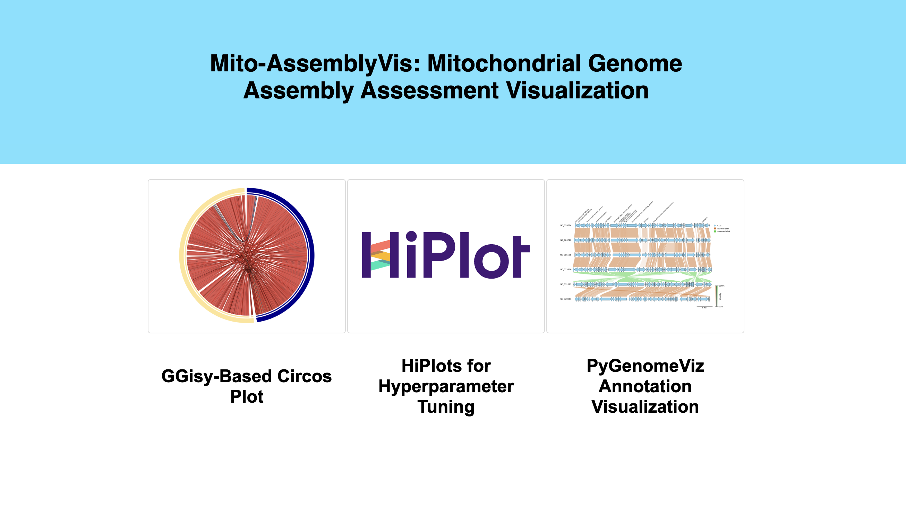

# Mito-AssemblyVis
Mitochondrial Genome Assembly Assessment Visualization

By: Armaghan Sarvar, Cecilia Yang

## Overview

Our project is implemented as an interactive web application using the Flask framework written in Python.

The main components are:

### The Visualization Modules:

* GGisy [1]: A Circos-based genome assembly consistency plot which is given a set of assembled contigs together with the reference genome and results in a quick qualitative view of the misassemblies and gaps in the assembly comparing the two input genomes. We have modified the original GGisy library implementation (`GGisy.py`) to fit it into our goal.


* HiPlot [2]: Given a set of hyper-parameters used by different assembly pipelines in a csv format, the HiPlot tool is used to illustrate the relationships between these parameters, such as the k-mer sizes, and the final assembly results, like the genome completeness. We have written a Python script (`HiPlot.py`) to use the original HiPlot library for this specific application. 

* PyGenomeViz [3]: We have used the PyGenomeViz library to create an annotation visualization tool using Python. It gets the following inputs, and compares the assembly pipelines with each other and with the reference genome, by showing all of this information in a linear setup.
Similar to HiPlot, we have written a Python script (`PyGenomeViz.py`) to use the features of the original PyGenomeViz package and fit it to our specific needs.

  * Genome annotation information (gene names, strand they are located on, and specific position), resulted from different assembly pipelies 
  * Sequencing read coverages
  * Genome Size 


### The Web Application Modules:

`data/`: Prepared data corresponding to Sea Otter species for comparing the three example mitogenome assembly pipelines: mtGasp (the novel in-house pipeline), MitoZ [4], and GetOrganelle [5]. 

`templates/`: The HTML files belonging to the web application

`static/`: The application .css file and used logos

## Setup

### Dependencies:
- python 3.9
- flask
- poppler
- pandas
- pdf2image
- pygenomeviz
- hiplot
- BLAST+ (Only needed for GGisy)
- R with the following libraries: (Only needed for GGisy)
   - omiccircos (pre: libcurl-openssl-dev)
   - RColorBrewer
   - varhandle

### Preparing the Environment 

1) Using the provided `environment.yml` file:

‍‍```
conda env create -f environment.yml 
conda activate Mito
```

2) Manual

You can also create an environment and manually install the packages.

```
conda create -n Mito python=3.9 
conda activate Mito 
conda install pandas 
conda install -c anaconda flask 
conda install -c conda-forge r-base
conda install -c conda-forge poppler 
conda install -c conda-forge pdf2image 
conda install -c conda-forge -c bioconda pygenomeviz 
conda install -c conda-forge hiplot
```
To run the app (in development mode), simply run:

```
python Flask.py
```

The app will be listening on port 31807 of the *local host*, and you can be navigated to the first page:




## References
[1] Sandro Valenzuela. GGisy. https://github.com/Sanrrone/GGisy. 2017.

[2] Facebook Research. HiPlot: High-dimensional interactive plots made easy. https://ai.facebook.com/blog/ hiplot-high-dimensional-interactive-plots-made-easy/.  Accessed:  2022-10-18.

[3] Moshi. pyGenomeViz. https://github.com/moshi4/pyGenomeViz. 2022. 

[4] Guanliang Meng et al. “MitoZ: a toolkit for animal mitochondrial genome assembly, annotation and visualization”. In: Nucleic Acids Research 47.11 (2019), e63.

[5] Jian-Jun Jin et al. “GetOrganelle: a fast and versatile toolkit for accurate de novo assembly of organelle genomes”. In: Genome biology 21.1 (2020), pp. 1–31.
